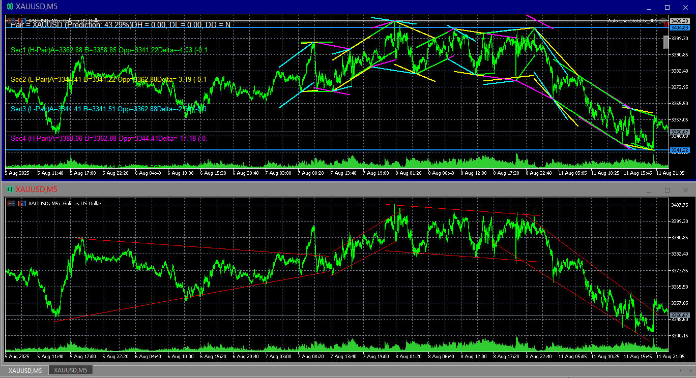
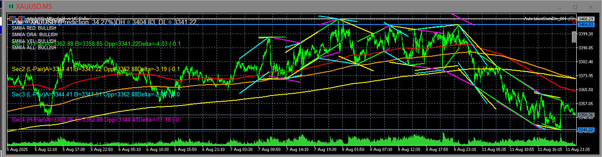

# Auto-LinesStatsEtc-ML
Status: Alpha - Its not complete/working yet.

### Description:
A MetaTrader 5 custom indicator designed for assisting manual trading on Gold pairs (e.g., XAUUSD).  
The indicator draws multiple configurable "channel sections" consisting of two trend lines each, predicts current unfolding price channels, and overlays important statistical information on the chart, including highs/lows for multiple timeframes and directional bias (Bull/Bear).  
The system also incorporates basic on-chart data-driven learning from historical market data (without Python) to enhance line placement and trend predictions. It is optimized for modern MT5 object drawing APIs.

### Features:
- Automatic gold pair detection on initialization (supports all common gold pair symbols).
- Error message if loaded on a non-gold pair, with suggestions of valid gold symbols.
- Configurable number of channel sections (default: 4).
- Each channel section:
  - Two parallel lines (upper/lower) representing support/resistance.
  - Calculated from the most complete recent sections of price movement.
  - Direction label (Bull/Bear) for each timeframe set.
- Information panel displaying:
  - Current pair name.
  - Day High (DH), Day Low (DL), Day Direction (DD).
  - Week High (WH), Week Low (WL), Week Direction (WD).
  - Year High (YH), Year Low (YL), Year Direction (YD).
- Machine learning component:
  - Uses available historical price data from the broker.
  - Analyzes and stores moving average trends, breakout frequency, and volatility patterns.
  - Adjusts predicted channel slope and placement based on historical data.
- Auto recalculation each new bar.
- Optional manual redrawing trigger (via chart button).
- Modular code with central control functions for:
  - Initialization
  - Pair detection
  - Historical data analysis
  - Channel detection
  - Drawing lines and text
  - Basic ML adjustments
  - Prediction refinement

### Media:
- I draw some lines in metatrader and gave GPT5 the image of the pair on the bottom part with the lines I drew, and several sessions later using additionally KIMIK2/Claude4, and then some tweaking (see `.set` file) it looks like the top pair in the image. 

- Here is when `Auto-LinesStatsEtc` is combined with `Gold Weekly` my other indicator, both are a bit buggy, but basically producing the desired effect, just need developing little further.

## Logic:
1. **Initialization Stage (`OnInit`)**
   - Detect chart symbol.
   - Validate if symbol is a recognized gold pair.
   - Load historical data for required timeframes (Day, Week, Year).
   - Initialize global variables and settings (sections count, line style, ML parameters).
   - Create chart objects for buttons and info panel.

2. **Pair Detection Function (`DetectGoldPair`)**
   - Compare chart symbol against a known list:  
     `XAUUSD, XAUUSDm, XAUEUR, XAUJPY, XAUAUD, XAUGBP, XAUCAD, XAUCHF`
   - If not matched, display error on chart and exit initialization.

3. **Historical Data Analysis (`AnalyzeHistory`)**
   - Calculate highs and lows for Day, Week, Year using `iHigh()` and `iLow()` with respective timeframes.
   - Determine direction (Bull/Bear) by comparing current close with previous high/low regions.
   - Store results for use in the info panel and trend calculations.

4. **Channel Detection (`DetectChannels`)**
   - Identify swing highs/lows using fractals or custom peak/valley detection.
   - Fit parallel lines through recent sections (number set in external input).
   - Determine slope and orientation (up, down, horizontal).
   - Mark each section with direction label.

5. **Drawing Functions (`DrawChannel`, `DrawInfoPanel`)**
   - Use `ObjectCreate()` with `OBJ_TREND` for lines.
   - Use `OBJ_LABEL` for textual data.
   - Dynamically position text panel in a fixed chart corner.
   - Each section’s two lines are stored and updated per recalculation.

6. **Machine Learning Component (`AdjustWithML`)**
   - From historical patterns, detect common slope angles and breakout probabilities.
   - Adjust current predicted channel slope and line positioning.
   - Update stored ML parameters incrementally without external scripts.

7. **Recalculation Trigger**
   - Runs automatically on each new bar (`OnCalculate`).
   - Manual button press triggers full redraw (`RedrawAll` function).

8. **Prediction Stage (`PredictNextChannel`)**
   - Based on current slope, volatility, and recent breakout patterns, estimate where next lines may form.
   - Draw light-colored "projection lines" ahead of current price.

### Development
- the text display looks corrupted, space between each displayed text line spaces content off display (remove line inbetween).
- the lines seem to stop mid-way across the screen, no matter how many sections I configured for.
- the lines should be white if they are going across with deadzone to <2.5% up/down for white (Straight), >2.5%-10% up/down for cyan/pink (SemiUp/SemiDown), and blue/red if >10% (Up/Down). I want what the current one is predicted to be based on current data, to be written.

### Revisions
- 001 - Initial upload.
- 002 - Text on external input comments made clearer.

### Research
- it would be nice to have sliders in the, externalInputs or chart window, for key settings, keeping things within known ranges. Is that possible in MetaTrader 5? Obviously Gradio interface would be more work, but solution if not.
